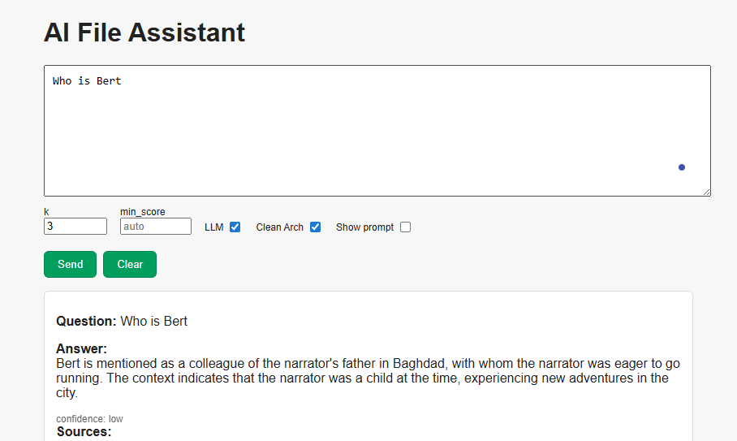
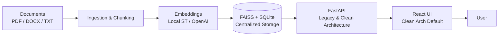

# AI File Assistant – Chat with Your Documents

> **Status: Experimental / Work In Progress**  
> This project is a proof-of-concept RAG (Retrieval-Augmented Generation) solution for local document search and chat.
> However, achieving high-precision answers requires careful tuning of indexing parameters, chunking strategies, 
> embedding models, and LLM configurations. Out-of-the-box results may not always be accurate and should be 
> validated against source documents. Use with caution for critical information retrieval.
> Features both legacy and modern Clean Architecture implementations with centralized data management.

## Why this project exists
Ever since Google discontinued its Desktop Search app it became harder for me to quickly find the *exact* piece of information buried inside gigabytes of mixed PDF / DOCX / TXT files. Traditional OS search (name / modified date) is not enough when you only remember a concept or a sentence fragment. So I started building my own lightweight, local-first AI file search + chat assistant using Retrieval Augmented Generation (RAG). This repository is a proof-of-concept implementation: an end‑to‑end pipeline from raw files → vector index → question answering.

This project demonstrates practical Retrieval‑Augmented Generation (RAG) – combining deterministic document retrieval with optional generative answering for grounded responses.

## What it does
* Recursively scans a chosen root folder (and all subfolders)
* Extracts text from PDF / DOCX / TXT (extensible)
* Cleans + splits content into overlapping chunks
* Generates embeddings (local SentenceTransformers model by default, or OpenAI if enabled)
* Stores embeddings + metadata locally (SQLite + FAISS index)
* Exposes FastAPI endpoints with both legacy and Clean Architecture implementations
* **Intelligent k-fallback strategy**: Automatically retries with different retrieval parameters (k+1, k-1, k-2) when initial answers are poor quality, improving answer reliability
* Provides React frontend with Clean Architecture enabled by default

## Screenshots


### Answer Quality and Fallback Strategy

The system includes an intelligent fallback mechanism that automatically improves answer quality:

1. **Initial attempt**: Uses specified k value for document retrieval
2. **Quality detection**: Analyzes answer for poor indicators (too short, generic responses, "not enough information")
3. **Automatic retry**: If answer is poor, tries alternative k values (k+1, k-1, k-2) 
4. **Best result selection**: Returns the best answer from all attempts

This fallback strategy significantly improves answer reliability, especially for edge cases where the initial retrieval parameters don't capture the most relevant information.

## Architecture Overview

The system supports two architectural approaches:

### Clean Architecture (Recommended)
- Modern hexagonal architecture with clear separation of concerns
- Domain-driven design with entities, repositories, and use cases
- Dependency injection container for better testability
- Centralized data storage in `data/uploads/` directory

### Legacy Architecture (Maintained)
- Original implementation for backward compatibility
- Direct service calls with minimal abstraction
- Shared data storage with Clean Architecture

Both architectures use the same underlying data and provide identical functionality.

## Important Notes on Answer Precision

While the system provides sophisticated retrieval and answer generation capabilities, **high-precision results require careful configuration**:

### Factors Affecting Answer Quality:
- **Document quality**: OCR errors, formatting issues, incomplete text extraction
- **Chunking strategy**: `CHUNK_SIZE` and `CHUNK_OVERLAP` must match document structure
- **Embedding model choice**: Domain-specific models may perform better than general ones
- **Retrieval parameters**: `k` value and `MIN_SCORE` thresholds need tuning per use case
- **LLM configuration**: Model choice, temperature, and prompt engineering significantly impact results

### Recommended Approach:
1. **Start with defaults** and test with known questions/answers
2. **Tune incrementally**: Adjust one parameter at a time
3. **Validate results**: Always cross-check answers against source documents
4. **Domain-specific training**: Consider fine-tuned models for specialized content

**The fallback strategy helps but cannot compensate for fundamentally poor document indexing or inappropriate model selection.**

## Architecture (mini diagram)
```
Documents (PDF / DOCX / TXT)
		↓
	Ingestion & Chunking
		↓
 Embeddings (Local SentenceTransformers / OpenAI)
		↓
   FAISS Vector Index + SQLite Metadata
		↓
		FastAPI (Legacy & Clean Architecture)
		↓
		React UI (Clean Architecture by default)
		↓
		User
```




## Tech stack
* Python 3.11+ (3.13 still has wheel gaps for some deps – use 3.11 for stability)
* sentence-transformers (default model: `paraphrase-multilingual-MiniLM-L12-v2` – multilingual incl. Serbian)
* FAISS (similarity search)
* SQLite (lightweight metadata store)
* FastAPI + Uvicorn (API layer with dual architecture support)
* Clean Architecture with dependency injection
* Intelligent k-fallback strategy for improved answer quality
* (Optional) OpenAI Embeddings (when `USE_OPENAI=true`)
* React + Vite + TypeScript frontend (Clean Architecture enabled by default)

## Repository structure
```
├─ src/
│  ├─ config.py               # Environment & constants (centralized paths)
│  ├─ ingest.py               # CLI ingestion script
│  ├─ chunking.py             # Text cleaning + chunking
│  ├─ embeddings.py           # Local or OpenAI embeddings
│  ├─ vector_store.py         # SQLite + FAISS wrapper (legacy)
│  ├─ rag_pipeline.py         # Retrieval + prompt assembly (legacy)
│  ├─ api.py                  # FastAPI server (both architectures)
│  ├─ container.py            # Dependency injection container
│  ├─ domain/                 # Clean Architecture domain layer
│  │  ├─ entities/            # Core business entities
│  │  ├─ repositories/        # Repository interfaces
│  │  └─ services/            # Domain services
│  ├─ application/            # Clean Architecture application layer
│  │  └─ use_cases/           # Application use cases
│  └─ infrastructure/         # Clean Architecture infrastructure layer
│     ├─ storage/             # FAISS and SQLite implementations
│     ├─ embeddings/          # Embedding service implementations
│     └─ llm/                 # LLM service implementations
├─ frontend/                  # React + Vite + TS UI (Clean Architecture default)
├─ data/
│  ├─ uploads/                # Centralized data storage
│  │  ├─ vector_db/           # SQLite databases
│  │  ├─ faiss/               # FAISS indices
│  │  ├─ logs/                # Application logs
│  │  └─ documents/           # Uploaded documents
│  └─ ingested/               # Processing workspace
├─ util/                      # Organized utility scripts
│  ├─ test/                   # Test scripts
│  └─ migration/              # Migration utilities
├─ tests/                     # Unit tests for Clean Architecture
└─ notebooks/                 # Exploration (future)
```

## Quick start
1. Create & activate a virtual environment (PowerShell) – recommended Python 3.11:
```powershell
python -m venv .venv
.venv\Scripts\Activate.ps1
```
2. Install dependencies:
```powershell
pip install -r requirements.txt
REM If you hit binary build problems on Windows, pin stable versions:
REM fastapi==0.111.0 uvicorn==0.30.3 pydantic==2.8.2 numpy==1.26.4 faiss-cpu==1.8.0.post1 sentence-transformers==2.7.0
```
3. (Optional) Copy `.env.example` to `.env` and adjust values.
4. Run ingestion for a folder of documents:
```powershell
python -m src.ingest --input "C:/path/to/your/documents" --batch 64
```
5. Start the API:
```powershell
uvicorn src.api:app --reload --port 8000
```
6. (Optional) Start the React frontend (in another shell):
```powershell
cd frontend
pnpm install   # or: npm install / yarn
pnpm run dev   # starts on http://localhost:5173
```
The Vite dev server proxies API calls to port 8000 (see `vite.config.ts`).

7. Ask a question (PowerShell example) directly (bypassing UI):
```powershell
# Using Clean Architecture endpoint (recommended)
Invoke-RestMethod -Method Post -Uri http://127.0.0.1:8000/v2/chat -Body (@{question='Who is the author of the book X?'} | ConvertTo-Json) -ContentType 'application/json'

# Using legacy endpoint
Invoke-RestMethod -Method Post -Uri http://127.0.0.1:8000/chat -Body (@{question='Who is the author of the book X?'} | ConvertTo-Json) -ContentType 'application/json'
```

## Environment variables (.env)
| Variable | Description | Example |
|----------|-------------|---------|
| OPENAI_API_KEY | Your OpenAI API key (only needed if using OpenAI embeddings or completion) | sk-... |
| EMBEDDING_MODEL | Hugging Face model id for local embeddings | sentence-transformers/all-MiniLM-L6-v2 |
| USE_OPENAI | Set to `true` to use OpenAI embeddings instead of local model | false |
| CHUNK_SIZE | Approx token/word count target per chunk | 300 |
| CHUNK_OVERLAP | Overlap size between consecutive chunks | 60 |
| DATA_DIR | Where to store runtime data | data |

All data is stored in the centralized `data/uploads/` directory structure:
- Vector databases: `data/uploads/vector_db/`
- FAISS indices: `data/uploads/faiss/`
- Application logs: `data/uploads/logs/`
- Uploaded documents: `data/uploads/documents/`

Copy `.env.example` to `.env` and fill in what you need.

## API Endpoints

The system provides multiple API endpoints:

### Chat Endpoints
| Endpoint | Description | Architecture | Usage |
|----------|-------------|--------------|-------|
| `/chat` | Legacy chat endpoint | Legacy | Use for backward compatibility |
| `/v2/chat` | Modern chat endpoint | Clean Architecture | Recommended for new integrations |

Both endpoints support:
- **Intelligent k-fallback strategy**: Automatically retries with different k values when answers are poor quality
- **Answer quality detection**: Identifies short, generic, or uninformative responses
- **Confidence scoring**: Provides confidence levels and quality indicators
- **Configurable retrieval parameters**: Adjustable k, min_score, and other parameters
- **OpenAI and local LLM support**: Flexible model backends

### Admin Endpoints
| Endpoint | Method | Description | Usage |
|----------|--------|-------------|--------|
| `/admin/stats` | GET | Get detailed system statistics including vector store metrics and configuration | Monitor system health |
| `/admin/reset` | POST | Clear/reset the vector store and all metadata | Start fresh with new documents |
| `/admin/refresh` | POST | Reload FAISS index after ingestion from another process | Sync after external ingest |

Example usage:
```powershell
# Chat with Clean Architecture (recommended)
Invoke-RestMethod -Method Post -Uri http://127.0.0.1:8000/v2/chat -Body (@{question='Who is the author of the book X?'} | ConvertTo-Json) -ContentType 'application/json'

# Chat with legacy endpoint
Invoke-RestMethod -Method Post -Uri http://127.0.0.1:8000/chat -Body (@{question='Who is the author of the book X?'} | ConvertTo-Json) -ContentType 'application/json'

# Get system statistics
Invoke-RestMethod -Uri http://127.0.0.1:8000/admin/stats

# Reset vector store (use with caution!)
Invoke-RestMethod -Method Post -Uri http://127.0.0.1:8000/admin/reset
```

## Getting API keys / accounts
1. OpenAI (optional):
	* Sign up: https://platform.openai.com/
	* Create API key in dashboard → set `OPENAI_API_KEY` in `.env`.
	* Set `USE_OPENAI=true` if you want OpenAI embeddings (higher quality, slower + billed).
2. Hugging Face (optional for private / large models):
	* https://huggingface.co/ → create account
	* (Only needed if you switch to a gated model) then `huggingface-cli login` or set `HF_TOKEN`.
3. (Future) Other vector DB providers (Pinecone, Weaviate, Milvus) can be added. For now everything is local.

## Current limitations and considerations

**Important**: RAG systems are complex and require careful tuning for reliable results. Default configurations may produce inaccurate or incomplete answers.

The system provides robust functionality with some technical limitations:

| Mode | What is used | Strengths | Limitations |
|------|--------------|-----------|-------------|
| Local (default) – no LLM | Heuristic sentence extractor over retrieved chunks | Fast, private, zero extra downloads | Not true generative reasoning; cannot synthesize across many chunks |
| Local + Ollama small model (e.g. `mistral`) | Retrieval + prompt → Mistral via Ollama | Better abstractive answers, multilingual | Needs model download (GBs), slower on CPU |
| OpenAI embeddings only (still no LLM) | Better semantic recall for niche wording | Higher embedding quality | Paid API, still heuristic answering |
| OpenAI + future completion (planned) | Full RAG + GPT-style generation | Best quality, reasoning | Cost, latency, privacy (data leaves machine) |

### Technical and Quality Considerations:
* **Answer accuracy varies significantly** with document quality, indexing parameters, and model choice
* **Fallback strategy helps but cannot fix fundamental configuration issues**
* FAISS id mapping uses simple approach (room for optimization)
* No incremental ingestion hashing (changing one file requires re-ingest consideration)  
* Only PDF / DOCX / TXT parsed out of the box (others need `--force-text` or custom parser)
* Legacy .doc skipped (conversion tool not bundled)
* No OCR: scanned PDFs with images produce little / no text
* Simple rerank + heuristic definition extractor (not a full reranker like ColBERT / CrossEncoder)

**Always validate answers against source documents, especially for critical information.**

### Relevance / Quality tips
If answers look unrelated:
* Ensure you re-ingested after changing the embedding model (.env EMBEDDING_MODEL)
* Check `/stats` to confirm documents are actually loaded
* Increase `MIN_SCORE` in `rag_pipeline.py` (currently 0.55) if you still see off-topic chunks
* Verify your PDFs actually contain *extractable* text (some are scanned images)
* Consider switching to an OCR pipeline for image-only PDFs (not included yet)

### When must you re-ingest?
You need a full re-ingest (with `--reset`) when:
1. You change the embedding model (`EMBEDDING_MODEL` or toggle `USE_OPENAI`) – vectors become incompatible.
2. You modify chunking parameters `CHUNK_SIZE` / `CHUNK_OVERLAP` – chunk boundaries change.
3. You delete or move many source files and want stale chunks removed.
4. You upgrade to a vector dimension that differs from the stored FAISS index.

You do NOT need re-ingest when:
* Only adjusting `MIN_SCORE` or reranking logic in `rag_pipeline.py`.
* Changing answer extraction heuristics.
* Editing frontend code.

Recommended workflow to experiment:
```powershell
python -m src.ingest --input "C:/docs" --reset   # clean slate
python -m src.ingest --input "C:/docs"           # re-run after minor parser tweak (same model)
```

### Virtual environment (Windows PowerShell)
```powershell
py -3.11 -m venv .venv
./.venv/Scripts/Activate.ps1
pip install -r requirements.txt
```
To deactivate: `deactivate`

### Python version
Target: **Python 3.11**. Reason: pre-built wheels (numpy / faiss / pydantic-core) are stable; Python 3.13 still misses some wheels -> slower builds or import errors.

Install 3.11 (Windows):
```powershell
winget install -e --id Python.Python.3.11
py -0p   # list installed versions
py -3.11 -m venv .venv
```

### Extension include / exclude examples
Base supported: `.pdf`, `.txt`, `.docx` ( `.doc` skipped). Add more:
```powershell
python -m src.ingest --input C:/docs --include-ext .md --include-ext .rst
```
Skip certain paths (substring match, repeat `--exclude`):
```powershell
python -m src.ingest --input C:/docs --exclude "node_modules" --exclude ".git" --exclude "backup"
```
Force treat unknown extensions as UTF-8 text (careful with binaries):
```powershell
python -m src.ingest --input C:/docs --force-text --include-ext .log
```
Skip huge forced-text files > 5MB:
```powershell
python -m src.ingest --input C:/docs --force-text --max-bytes 5000000
```

Exclude e.g. `.zip` by simply not adding it (zip is ignored); if you previously added broad patterns and want to ensure exclusion you can use `--exclude .zip`.

### Controlling answer precision
Edit `src/rag_pipeline.py`:
* `MIN_SCORE` – raise to require stronger semantic similarity (fewer but more precise answers)
* Retrieval depth: in `answer_question` call (currently `k=5` in `api.py`). Reduce to `k=3` for higher precision, increase for recall.
* Rerank logic `_lexical_rerank` – can adjust weight `0.08` if lexical overlap should count more/less.

### Parameter impact cheat sheet
| Parameter | Where | Lower Value Effect | Higher Value Effect | When to Tune |
|-----------|-------|--------------------|---------------------|--------------|
| CHUNK_SIZE | `.env` / `config.py` | Finer granularity, better pinpoint definitions, more chunks = slower ingest | Broader semantic coverage, risk of diluted signal | Definitions missed or too many partial sentences |
| CHUNK_OVERLAP | `.env` / `config.py` | Less redundancy, may cut sentences | Smoother context continuity, more duplicates | If answers often cut mid-sentence increase slightly |
| MIN_SCORE | `rag_pipeline.py` | More recall (may allow noise) | Higher precision (more “Not enough information”) | If many off-topic answers raise; if too many fallbacks lower |
| k (retrieval depth) | `api.py` / call param | Faster, less noise | Better recall, more rerank work | If sources irrelevant, lower; if misses info, raise |
| Rerank weight (0.08) | `_lexical_rerank` | Semantic emphasis | Lexical keyword emphasis | If exact terms important (names) increase a bit |
| `--min-chars` ingest | CLI | Include tiny fragments (maybe noise) | Skip short low-value chunks | If seeing trivial boilerplate, raise |

Suggested starting set (already defaults now): `CHUNK_SIZE=300`, `CHUNK_OVERLAP=60`, `k=3`, `MIN_SCORE=0.50–0.60`.

### Using Ollama (local LLM)
Ollama lets you run models locally via simple CLI & HTTP API.
Install (Windows via WSL or native installer when available): https://ollama.com/
After install:
```bash
ollama pull mistral
ollama run mistral  # quick test
```
Configure `.env`:
```
OLLAMA_MODEL=mistral
```
Then set `use_local_llm=True` when calling `answer_question` (wire a flag later or modify `api.py`).

Approx model sizes (compressed quantized, vary by format):
| Model | Size (approx) | Traits |
|-------|---------------|--------|
| mistral | 4‑7 GB (Q4/Q6) | Fast, strong general reasoning |
| llama3 8B | 4‑8 GB | Good English, broad knowledge |
| phi3 mini | 2‑3 GB | Very small, faster, weaker long context |
| neural-chat | 4‑6 GB | Conversational tuned |

Pros: private, no API cost. Cons: memory footprint, slower on pure CPU. If GPU exists (CUDA / Metal) speed improves drastically.

### Hugging Face – what you gain
Hugging Face hub hosts thousands of embedding & LLM models.
Benefits:
* Swap embedding model quickly (domain‑specific, multilingual)
* Access fine‑tuned models (legal, medical, code)
* Use `huggingface-cli login` to access gated or large models

To change embedding model:
1. Set `EMBEDDING_MODEL` in `.env` (e.g. `sentence-transformers/all-mpnet-base-v2`)
2. Re-ingest with `--reset`
3. Restart API

Large models may increase RAM and ingest time. Start with smaller ones (MiniLM, paraphrase-multilingual) before moving up.

### FAQ quick answers
Q: I changed `MIN_SCORE`, do I need to re-ingest? → No.
Q: I changed `EMBEDDING_MODEL`? → Yes, `--reset` + ingest.
Q: I added more .md files? → Just run ingest (without `--reset`) to add them (old ones stay).
Q: I want to remove files I deleted from source? → Currently manual: --reset then ingest.

### Enterprise / Practical Use Cases

Examples where local RAG helps (without sending data to the cloud):
- Law firms – quick search of contracts and clauses (clause pinpointing)
- Banks / financial institutions – compliance and policy documentation (which is already internal, sensitive)
- Academia / research teams – Q&A across large corpora of scientific papers or scripts
- Internal onboarding – new employees asking questions over internal documentation
- Regulated industries – local processing without data leaving the premises (privacy / sovereignty)

These domains gain the most value when:
(1) documents are semi-structured,
(2) there’s frequent need for precise passages,
(3) privacy prevents SaaS services.

## Frontend (React + Vite)
The project ships with a React UI providing live controls and real-time interaction with both architectures.

Features:
- Clean Architecture enabled by default (recommended)
- Live parameter controls (k, min_score, LLM on/off)
- Chunk score previews and confidence metadata
- Keyword coverage analysis
- Raw prompt inspection
- **Fallback strategy monitoring**: Shows when k-fallback was triggered and which k value was ultimately used
- **Answer quality indicators**: Displays confidence levels and quality assessment results

Prerequisites:
* Node.js 18+ (recommended) / PNPM (preferred) or npm / yarn

Development:
```powershell
cd frontend
pnpm install   # or npm install / yarn
pnpm run dev   # http://localhost:5173 (auto-proxy to :8000 backend)
```
Environment override (if backend not on localhost:8000):
```powershell
VITE_API_URL=http://192.168.1.10:8000 pnpm run dev
```
Production build:
```powershell
pnpm run build
```
Serve `frontend/dist` with any static server (NGINX, `npx serve`, or mount via FastAPI StaticFiles if later added).

## Utility Scripts Organization

The `util/` directory contains organized development and maintenance scripts:

### Test Scripts (`util/test/`)
Contains various test scripts for validating functionality:
- Architecture comparison tests
- Fallback strategy validation
- Error handling verification
- Configuration testing

Run tests from project root:
```powershell
.\.venv\Scripts\python.exe util\test\test_centralized.py
```

### Migration Scripts (`util/migration/`)
Contains data migration and transformation utilities:
- Legacy to Clean Architecture migration
- Data format conversions
- System upgrade helpers

Run migration scripts from project root:
```powershell
.\.venv\Scripts\python.exe util\migration\migrate_data.py
```

Both directories include README files with detailed documentation for each script.


## Roadmap / TODO (updated)
* [x] Enhanced error handling system with custom exceptions and decorators
* [x] Rich markup integration for colored console output  
* [x] Admin endpoints: `/admin/reset`, `/admin/stats` for safer operations
* [x] Dependency injection and testability improvements (3/10 → 8/10)
* [x] Function decomposition: answer_question() split into focused functions
* [x] Clean Architecture implementation with domain-driven design
* [x] Intelligent k-fallback strategy for improved answer quality
* [x] Centralized data management in `data/uploads/` structure
* [x] Frontend: Clean Architecture enabled by default
* [x] Dual architecture support (legacy + Clean Architecture)
* [ ] Switch answer path to real LLM (Ollama flag fully surfaced in API for all requests)
* [ ] Proper FAISS ID ↔ document mapping (avoid full scan join)
* [ ] Incremental ingest (hash + skip unchanged, delete removed)
* [ ] OCR pipeline for scanned PDFs (Tesseract or PaddleOCR integration)
* [ ] Cross-encoder reranker option for higher precision
* [ ] Support legacy .doc via optional dependency (antiword) when present
* [ ] Dockerfile + compose (API + frontend)
* [ ] Evaluation script (gold QA pairs, MRR / Recall metrics)

## Contributing
Open an issue for bugs or feature requests. PRs welcome once an issue is discussed.

## License
MIT

---
If this helps you reclaim your local knowledge base, give it a star and keep building.
