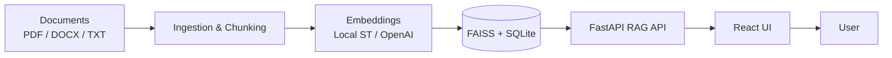

# AI File Assistant – Chat with Your Documents

> **Status: Experimental / Work In Progress**  
> Status: Experimental / Work In Progress
> This is an experimental project in active development – not production-ready.
> There are no guarantees for API stability, index format compatibility, or answer accuracy.
> Do not use it for confidential / sensitive data without additional security measures.
> Expect changes in index structure, parameters, and behavior without backward compatibility.

## Why this project exists
Ever since Google discontinued its Desktop Search app it became harder for me to quickly find the *exact* piece of information buried inside gigabytes of mixed PDF / DOCX / TXT files. Traditional OS search (name / modified date) is not enough when you only remember a concept or a sentence fragment. So I started building my own lightweight, local-first AI file search + chat assistant using Retrieval Augmented Generation (RAG). This repository is the foundation: an end‑to‑end pipeline from raw files → vector index → question answering.

This project is a practical example of Retrieval‑Augmented Generation (RAG) – combining deterministic document retrieval with optional generative answering for grounded responses.

## What it does
* Recursively scans a chosen root folder (and all subfolders)
* Extracts text from PDF / DOCX / TXT (extensible)
* Cleans + splits content into overlapping chunks
* Generates embeddings (local SentenceTransformers model by default, or OpenAI if enabled)
* Stores embeddings + metadata locally (SQLite + FAISS index)
* Exposes a simple FastAPI endpoint to ask questions → retrieves top relevant chunks → (placeholder LLM step) returns an answer

Later you can plug in any LLM (OpenAI / Anthropic / local) to replace the placeholder answer logic.

## Architecture (mini diagram)
```
Documents (PDF / DOCX / TXT)
		↓
	Ingestion & Chunking
		↓
 Embeddings (Local SentenceTransformers / OpenAI)
		↓
   FAISS Vector Index + SQLite Metadata
		↓
		FastAPI (RAG Pipeline)
		↓
		React UI
		↓
		User
```




## Tech stack
* Python 3.11+ (3.13 still has wheel gaps for some deps – use 3.11 for stability)
* sentence-transformers (default model: `paraphrase-multilingual-MiniLM-L12-v2` – multilingual incl. Serbian)
* FAISS (similarity search)
* SQLite (lightweight metadata store)
* FastAPI + Uvicorn (API layer)
* (Optional) OpenAI Embeddings (when `USE_OPENAI=true`)
* React + Vite + TypeScript frontend (runtime tuning controls, highlighting, confidence metadata)

## Repository structure
```
├─ src/
│  ├─ config.py          # Environment & constants
│  ├─ ingest.py          # CLI ingestion script
│  ├─ chunking.py        # Text cleaning + chunking
│  ├─ embeddings.py      # Local or OpenAI embeddings
│  ├─ vector_store.py    # SQLite + FAISS wrapper
│  ├─ rag_pipeline.py    # Retrieval + prompt assembly
│  ├─ api.py             # FastAPI server
├─ frontend/             # React + Vite + TS UI (k, min_score, LLM toggle, previews, confidence)
├─ data/                 # Runtime data (db, index)
│  └─ ingested/
├─ notebooks/            # Exploration (future)
```

## Quick start
1. Create & activate a virtual environment (PowerShell) – recommended Python 3.11:
```powershell
python -m venv .venv
.venv\Scripts\Activate.ps1
```
2. Install dependencies:
```powershell
pip install -r requirements.txt
REM If you hit binary build problems on Windows, pin stable versions:
REM fastapi==0.111.0 uvicorn==0.30.3 pydantic==2.8.2 numpy==1.26.4 faiss-cpu==1.8.0.post1 sentence-transformers==2.7.0
```
3. (Optional) Copy `.env.example` to `.env` and adjust values.
4. Run ingestion for a folder of documents:
```powershell
python -m src.ingest --input "C:/path/to/your/documents" --batch 64
```
5. Start the API:
```powershell
uvicorn src.api:app --reload --port 8000
```
6. (Optional) Start the React frontend (in another shell):
```powershell
cd frontend
pnpm install   # or: npm install / yarn
pnpm run dev   # starts on http://localhost:5173
```
The Vite dev server proxies API calls to port 8000 (see `vite.config.ts`).

7. Ask a question (PowerShell example) directly (bypassing UI):
```powershell
Invoke-RestMethod -Method Post -Uri http://127.0.0.1:8000/chat -Body (@{question='Who is the author of the book X?'} | ConvertTo-Json) -ContentType 'application/json'
```

## Environment variables (.env)
| Variable | Description | Example |
|----------|-------------|---------|
| OPENAI_API_KEY | Your OpenAI API key (only needed if using OpenAI embeddings or later completion) | sk-... |
| EMBEDDING_MODEL | Hugging Face model id for local embeddings | sentence-transformers/all-MiniLM-L6-v2 |
| USE_OPENAI | Set to `true` to use OpenAI embeddings instead of local model | false |
| CHUNK_SIZE | Approx token/word count target per chunk | 300 |
| CHUNK_OVERLAP | Overlap size between consecutive chunks | 60 |
| DATA_DIR | Where to store db + index | data |

Copy `.env.example` to `.env` and fill in what you need.

## Getting API keys / accounts
1. OpenAI (optional):
	* Sign up: https://platform.openai.com/
	* Create API key in dashboard → set `OPENAI_API_KEY` in `.env`.
	* Set `USE_OPENAI=true` if you want OpenAI embeddings (higher quality, slower + billed).
2. Hugging Face (optional for private / large models):
	* https://huggingface.co/ → create account
	* (Only needed if you switch to a gated model) then `huggingface-cli login` or set `HF_TOKEN`.
3. (Future) Other vector DB providers (Pinecone, Weaviate, Milvus) can be added. For now everything is local.

## Current limitations
Limitations depend on what you enable:

| Mode | What is used | Strengths | Limitations |
|------|--------------|-----------|-------------|
| Local (default) – no LLM | Heuristic sentence extractor over retrieved chunks | Fast, private, zero extra downloads | Not true generative reasoning; cannot synthesize across many chunks |
| Local + Ollama small model (e.g. `mistral`) | Retrieval + prompt → Mistral via Ollama | Better abstractive answers, multilingual | Needs model download (GBs), slower on CPU |
| OpenAI embeddings only (still no LLM) | Better semantic recall for niche wording | Higher embedding quality | Paid API, still heuristic answering |
| OpenAI + future completion (planned) | Full RAG + GPT-style generation | Best quality, reasoning | Cost, latency, privacy (data leaves machine) |

General technical limits (current code):
* FAISS id mapping is simplistic (full row scan)
* No incremental ingestion hashing (changing one file requires whole re-ingest)
* Only PDF / DOCX / TXT parsed out of the box (others need `--force-text` or custom parser)
* Legacy .doc skipped (conversion tool not bundled)
* No OCR: scanned PDFs with images produce little / no text
* Simple rerank + heuristic definition extractor (not a full reranker like ColBERT / CrossEncoder)

### Relevance / Quality tips
If answers look unrelated:
* Ensure you re-ingested after changing the embedding model (.env EMBEDDING_MODEL)
* Check `/stats` to confirm documents are actually loaded
* Increase `MIN_SCORE` in `rag_pipeline.py` (currently 0.55) if you still see off-topic chunks
* Verify your PDFs actually contain *extractable* text (some are scanned images)
* Consider switching to an OCR pipeline for image-only PDFs (not included yet)

### When must you re-ingest?
You need a full re-ingest (with `--reset`) when:
1. You change the embedding model (`EMBEDDING_MODEL` or toggle `USE_OPENAI`) – vectors become incompatible.
2. You modify chunking parameters `CHUNK_SIZE` / `CHUNK_OVERLAP` – chunk boundaries change.
3. You delete or move many source files and want stale chunks removed.
4. You upgrade to a vector dimension that differs from the stored FAISS index.

You do NOT need re-ingest when:
* Only adjusting `MIN_SCORE` or reranking logic in `rag_pipeline.py`.
* Changing answer extraction heuristics.
* Editing frontend code.

Recommended workflow to experiment:
```powershell
python -m src.ingest --input "C:/docs" --reset   # clean slate
python -m src.ingest --input "C:/docs"           # re-run after minor parser tweak (same model)
```

### Virtual environment (Windows PowerShell)
```powershell
py -3.11 -m venv .venv
./.venv/Scripts/Activate.ps1
pip install -r requirements.txt
```
To deactivate: `deactivate`

### Python version
Target: **Python 3.11**. Reason: pre-built wheels (numpy / faiss / pydantic-core) are stable; Python 3.13 still misses some wheels -> slower builds or import errors.

Install 3.11 (Windows):
```powershell
winget install -e --id Python.Python.3.11
py -0p   # list installed versions
py -3.11 -m venv .venv
```

### Extension include / exclude examples
Base supported: `.pdf`, `.txt`, `.docx` ( `.doc` skipped). Add more:
```powershell
python -m src.ingest --input C:/docs --include-ext .md --include-ext .rst
```
Skip certain paths (substring match, repeat `--exclude`):
```powershell
python -m src.ingest --input C:/docs --exclude "node_modules" --exclude ".git" --exclude "backup"
```
Force treat unknown extensions as UTF-8 text (careful with binaries):
```powershell
python -m src.ingest --input C:/docs --force-text --include-ext .log
```
Skip huge forced-text files > 5MB:
```powershell
python -m src.ingest --input C:/docs --force-text --max-bytes 5000000
```

Exclude e.g. `.zip` by simply not adding it (zip is ignored); if you previously added broad patterns and want to ensure exclusion you can use `--exclude .zip`.

### Controlling answer precision
Edit `src/rag_pipeline.py`:
* `MIN_SCORE` – raise to require stronger semantic similarity (fewer but more precise answers)
* Retrieval depth: in `answer_question` call (currently `k=5` in `api.py`). Reduce to `k=3` for higher precision, increase for recall.
* Rerank logic `_lexical_rerank` – can adjust weight `0.08` if lexical overlap should count more/less.

### Parameter impact cheat sheet
| Parameter | Where | Lower Value Effect | Higher Value Effect | When to Tune |
|-----------|-------|--------------------|---------------------|--------------|
| CHUNK_SIZE | `.env` / `config.py` | Finer granularity, better pinpoint definitions, more chunks = slower ingest | Broader semantic coverage, risk of diluted signal | Definitions missed or too many partial sentences |
| CHUNK_OVERLAP | `.env` / `config.py` | Less redundancy, may cut sentences | Smoother context continuity, more duplicates | If answers often cut mid-sentence increase slightly |
| MIN_SCORE | `rag_pipeline.py` | More recall (may allow noise) | Higher precision (more “Not enough information”) | If many off-topic answers raise; if too many fallbacks lower |
| k (retrieval depth) | `api.py` / call param | Faster, less noise | Better recall, more rerank work | If sources irrelevant, lower; if misses info, raise |
| Rerank weight (0.08) | `_lexical_rerank` | Semantic emphasis | Lexical keyword emphasis | If exact terms important (names) increase a bit |
| `--min-chars` ingest | CLI | Include tiny fragments (maybe noise) | Skip short low-value chunks | If seeing trivial boilerplate, raise |

Suggested starting set (already defaults now): `CHUNK_SIZE=300`, `CHUNK_OVERLAP=60`, `k=3`, `MIN_SCORE=0.50–0.60`.

### Using Ollama (local LLM)
Ollama lets you run models locally via simple CLI & HTTP API.
Install (Windows via WSL or native installer when available): https://ollama.com/
After install:
```bash
ollama pull mistral
ollama run mistral  # quick test
```
Configure `.env`:
```
OLLAMA_MODEL=mistral
```
Then set `use_local_llm=True` when calling `answer_question` (wire a flag later or modify `api.py`).

Approx model sizes (compressed quantized, vary by format):
| Model | Size (approx) | Traits |
|-------|---------------|--------|
| mistral | 4‑7 GB (Q4/Q6) | Fast, strong general reasoning |
| llama3 8B | 4‑8 GB | Good English, broad knowledge |
| phi3 mini | 2‑3 GB | Very small, faster, weaker long context |
| neural-chat | 4‑6 GB | Conversational tuned |

Pros: private, no API cost. Cons: memory footprint, slower on pure CPU. If GPU exists (CUDA / Metal) speed improves drastically.

### Hugging Face – what you gain
Hugging Face hub hosts thousands of embedding & LLM models.
Benefits:
* Swap embedding model quickly (domain‑specific, multilingual)
* Access fine‑tuned models (legal, medical, code)
* Use `huggingface-cli login` to access gated or large models

To change embedding model:
1. Set `EMBEDDING_MODEL` in `.env` (e.g. `sentence-transformers/all-mpnet-base-v2`)
2. Re-ingest with `--reset`
3. Restart API

Large models may increase RAM and ingest time. Start with smaller ones (MiniLM, paraphrase-multilingual) before moving up.

### FAQ quick answers
Q: I changed `MIN_SCORE`, do I need to re-ingest? → No.
Q: I changed `EMBEDDING_MODEL`? → Yes, `--reset` + ingest.
Q: I added more .md files? → Just run ingest (without `--reset`) to add them (old ones stay).
Q: I want to remove files I deleted from source? → Currently manual: --reset then ingest.

### Enterprise / Practical Use Cases

Examples where local RAG helps (without sending data to the cloud):
- Law firms – quick search of contracts and clauses (clause pinpointing)
- Banks / financial institutions – compliance and policy documentation (which is already internal, sensitive)
- Academia / research teams – Q&A across large corpora of scientific papers or scripts
- Internal onboarding – new employees asking questions over internal documentation
- Regulated industries – local processing without data leaving the premises (privacy / sovereignty)

These domains gain the most value when:
(1) documents are semi-structured,
(2) there’s frequent need for precise passages,
(3) privacy prevents SaaS services.

## Frontend (React + Vite)
The project ships with an optional React UI providing live controls (k, min_score, LLM on/off), chunk score previews, keyword coverage, confidence & reason labels, and raw prompt inspection.

Prerequisites:
* Node.js 18+ (recommended) / PNPM (preferred) or npm / yarn

Development:
```powershell
cd frontend
pnpm install   # or npm install / yarn
pnpm run dev   # http://localhost:5173 (auto-proxy to :8000 backend)
```
Environment override (if backend not on localhost:8000):
```powershell
VITE_API_URL=http://192.168.1.10:8000 pnpm run dev
```
Production build:
```powershell
pnpm run build
```
Serve `frontend/dist` with any static server (NGINX, `npx serve`, or mount via FastAPI StaticFiles if later added).


## Roadmap / TODO (updated)
* [ ] Switch answer path to real LLM (Ollama flag fully surfaced in API for all requests)
* [ ] Proper FAISS ID ↔ document mapping (avoid full scan join)
* [ ] Incremental ingest (hash + skip unchanged, delete removed)
* [ ] OCR pipeline for scanned PDFs (Tesseract or PaddleOCR integration)
* [ ] Cross-encoder reranker option for higher precision
* [x] Frontend: highlight snippet previews + score + confidence metadata
* [ ] Admin endpoints: `/admin/reset`, `/admin/reindex` safer operations
* [ ] Support legacy .doc via optional dependency (antiword) when present
* [ ] Dockerfile + compose (API + frontend)
* [ ] Evaluation script (gold QA pairs, MRR / Recall metrics)

## Contributing
Open an issue for bugs or feature requests. PRs welcome once an issue is discussed.

## License
MIT

---
If this helps you reclaim your local knowledge base, give it a star and keep building.
